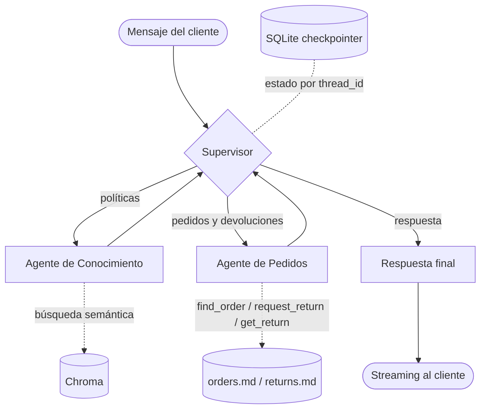
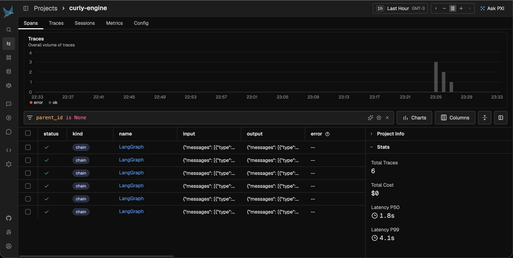
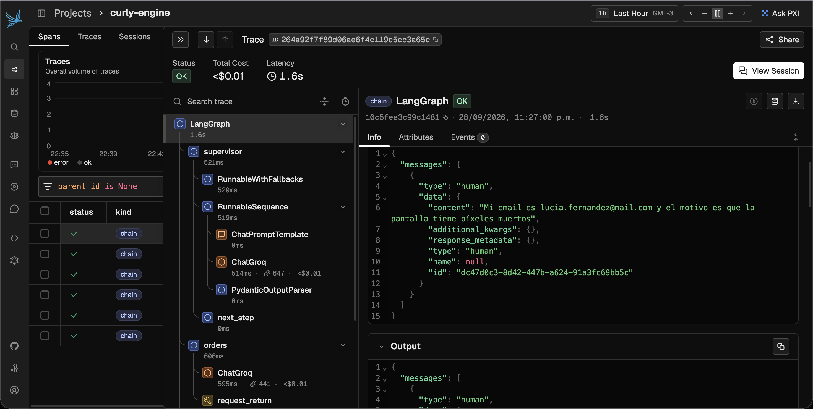
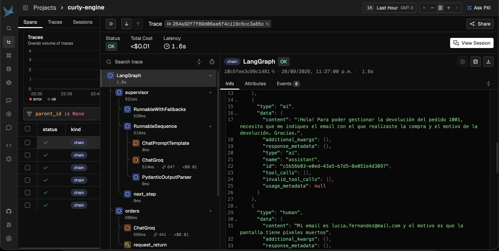

# curly-engine

Asistente de soporte al cliente para **Tienda Nodo**, una tienda online de electrónica ficticia. Responde consultas sobre las políticas de la tienda, consulta pedidos y gestiona devoluciones.

Integra:

- **RAG** sobre las políticas de la tienda (Chroma + embeddings de Gemini), con control de alucinaciones.
- **LLM** `openai/gpt-oss-120b` servido por Groq para el Supervisor, los agentes y la respuesta final.
- **Multi-agente con LangGraph**: un Supervisor que delega en agentes especializados, con memoria persistente por conversación (`AsyncSqliteSaver`, `thread_id`).
- **API asíncrona** en FastAPI con validación Pydantic y respuesta en streaming (SSE).
- **Observabilidad** con Arize Phoenix.

## Casos de uso

| Consulta | Quién la resuelve |
|---|---|
| "¿Cuántos días tengo para devolver un producto?" | Agente de Conocimiento (RAG) |
| "¿Dónde está mi pedido 1003? Mi email es ..." | Agente de Pedidos |
| "Quiero devolver el pedido 1001" | Agente de Pedidos: pide el email y el motivo si faltan, valida las reglas y registra la devolución |
| "¿Puedo devolver mis auriculares del pedido 1002? ¿Qué cubre la garantía?" | Agente de Pedidos + Agente de Conocimiento |
| "¿Tienen descuento para estudiantes?" | Agente de Conocimiento: responde que no tiene esa información en lugar de inventar |

## Arquitectura



Hay una versión interactiva del diagrama de arquitectura en [`doc/arquitectura.html`](doc/arquitectura.html).

- **Supervisor**: lee la conversación y arma un plan de hasta dos pasos, uno por agente (por ejemplo, consultar un pedido y después la política correspondiente). Llama al modelo una sola vez por mensaje: cuando un agente termina, vuelve al Supervisor, que pasa al siguiente paso del plan o a la respuesta final.
- **Agente de Conocimiento**: busca en las políticas. Si ningún fragmento supera el umbral de relevancia (`RETRIEVAL_MIN_SCORE`), responde que no tiene la información sin llamar al modelo. Si el modelo cita fuentes que no fueron recuperadas, descarta la respuesta. Si la salida no pasa la validación, reintenta y después devuelve una respuesta segura.
- **Agente de Pedidos**: elige y ejecuta las tools para consultar pedidos y crear devoluciones, y reporta su resultado tal cual. Las reglas (30 días desde la entrega, pedido entregado, categorías sin devolución, una devolución por pedido) se validan en código, no en el prompt.
- **Respuesta final**: redacta la respuesta al cliente usando solo lo que aportaron los agentes. Es el único nodo que se transmite por streaming.

```
app/
  api/       endpoints y schemas
  agents/    grafo, supervisor, agentes
  rag/       ingesta y retriever
  orders/    pedidos y devoluciones sobre archivos markdown
  core/      configuración, modelos (Groq y Gemini), tracing
data/        políticas, pedidos y devoluciones
scripts/     demo.py
tests/
```

## Ejecución

Requisitos: Docker, una API key de Groq ([GroqCloud](https://console.groq.com/keys)) para el chat y una de Gemini ([Google AI Studio](https://aistudio.google.com/apikey)) para los embeddings. Ambas tienen plan gratuito.

```bash
cp .env.example .env   # completar GROQ_API_KEY y GOOGLE_API_KEY
./run.sh
```

Levanta la API (`localhost:8000`), Chroma (`localhost:8001`) y Phoenix (`localhost:6006`). En el primer arranque se indexan las políticas de `data/policies`.

### Endpoints

| Método | Ruta | Descripción |
|---|---|---|
| `POST` | `/chat` | `{"thread_id": "...", "message": "..."}`. Responde en SSE: eventos `token` y un `done` final, o un evento `error` si falla el modelo. |
| `GET` | `/threads/{thread_id}/history` | Historial de la conversación. |
| `POST` | `/ingest` | Reindexa las políticas. |
| `GET` | `/health` | Estado del servicio. |

Documentación interactiva en `http://localhost:8000/docs`.

```bash
curl -N localhost:8000/chat \
  -H 'Content-Type: application/json' \
  -d '{"thread_id": "prueba-1", "message": "¿Cuánto cuesta el envío a Córdoba?"}'
```

### Demo y trazas

```bash
uv run python scripts/demo.py
```

Ejecuta cinco conversaciones (política, pedido, pedido + política, pregunta sin sustento y seguimiento con memoria). Las trazas quedan en Phoenix, en el proyecto `curly-engine`.



Detalle del segundo mensaje de la conversación con memoria: el Supervisor delega en el Agente de Pedidos, que registra la devolución con `request_return`.



La salida de esa traza incluye el historial que el checkpointer guardó para el `thread_id`: la respuesta del primer mensaje, que pedía el email y el motivo, y el mensaje del cliente con esos datos.



El plan gratuito de Groq permite 8000 tokens por minuto y cada mensaje usa como máximo 4 llamados al modelo (unos 2500 tokens), así que el demo espera 20 segundos entre mensajes (`DEMO_PAUSE` para cambiarlo). Si se supera el límite, `/chat` responde con un evento `error` y alcanza con reintentar al minuto.

### Datos

Los pedidos de prueba están en `data/orders.md` y las devoluciones que se crean se agregan a `data/returns.md`. Ambos se pueden editar a mano. El plazo de devolución se calcula con la fecha actual, así que puede ser necesario actualizar `fecha_entrega` para probar devoluciones válidas.

## Desarrollo

```bash
uv sync
uv run pytest
uv run ruff check .
```

Para correr la API fuera de Docker:

```bash
uv run chroma run --port 8001 --path var/chroma
uv run uvicorn app.main:app --reload     # con TRACING_ENABLED=false si Phoenix no está corriendo
```

Los tests no llaman a Groq ni a Gemini: usan modelos simulados.
